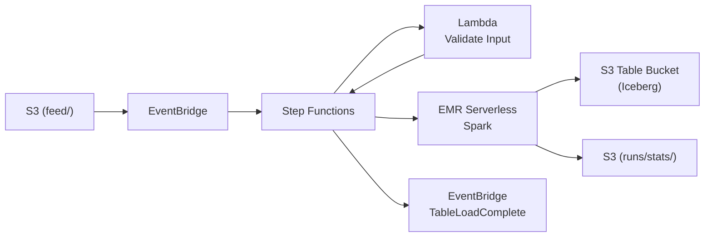

# aws-sam-serverless-etl

Serverless ETL pipeline that ingests Parquet files from S3 into [S3 Table Buckets](https://docs.aws.amazon.com/AmazonS3/latest/userguide/s3-tables.html) (managed Apache Iceberg) using AWS SAM, Step Functions, Lambda, and EMR Serverless.

## Architecture



### Data Layer

| Path | Purpose |
|------|---------|
| `feed/` | Incoming Parquet files |
| `runs/<execution>/stats/` | Per-table job stats JSON |
| `emr/` | PySpark script and dependency JARs |

### Compute Layer

| Service | Role |
|---------|------|
| Lambda | Validates input and resolves table names from file patterns |
| EMR Serverless (Spark) | Reads Parquet and writes to S3 Table Bucket via Iceberg |

### Orchestration Layer

| Service | Role |
|---------|------|
| Step Functions | Orchestrates validation → parallel EMR jobs → stats collection → EventBridge notification |
| EventBridge | Triggers the state machine when a file lands in `feed/` |

## Requirements

- Python 3.13
- [AWS SAM CLI](https://docs.aws.amazon.com/serverless-application-model/latest/developerguide/install-sam-cli.html)
- AWS CLI with a configured profile

## Build and Deploy

```bash
PROFILE='dev'
STACK_NAME='serverless-etl-s3-to-iceberg'

# Build and deploy the SAM stack
sam build
sam deploy

# Grab the data bucket name from stack outputs
aws cloudformation describe-stacks \
  --stack-name "$STACK_NAME" \
  --query "Stacks[0].Outputs" \
  --output json \
  --profile "$PROFILE" > stack-outputs.json

DATA_BUCKET=$(jq -r '.[] | select(.OutputKey=="DataBucketName") | .OutputValue' stack-outputs.json)

# Upload the PySpark script
aws s3 cp emr/load_data.py "s3://${DATA_BUCKET}/emr/load_data.py" --profile "$PROFILE"

# Download and upload the S3 Tables Catalog for Iceberg runtime JAR
# (not bundled with EMR Serverless — required for software.amazon.s3tables.iceberg.S3TablesCatalog)
S3_TABLES_CATALOG_VERSION='0.1.8'
curl -sL -o "/tmp/s3-tables-catalog-for-iceberg-runtime-${S3_TABLES_CATALOG_VERSION}.jar" \
  "https://repo1.maven.org/maven2/software/amazon/s3tables/s3-tables-catalog-for-iceberg-runtime/${S3_TABLES_CATALOG_VERSION}/s3-tables-catalog-for-iceberg-runtime-${S3_TABLES_CATALOG_VERSION}.jar"

aws s3 cp "/tmp/s3-tables-catalog-for-iceberg-runtime-${S3_TABLES_CATALOG_VERSION}.jar" \
  "s3://${DATA_BUCKET}/emr/jars/s3-tables-catalog-for-iceberg-runtime-${S3_TABLES_CATALOG_VERSION}.jar" \
  --profile "$PROFILE"
```

## Run

Upload a Parquet file to the `feed/` prefix to trigger the pipeline:

```bash
aws s3 cp test-data.parquet "s3://${DATA_BUCKET}/feed/test-data.parquet" --profile "$PROFILE"
```

The state machine will start automatically via the EventBridge rule.
