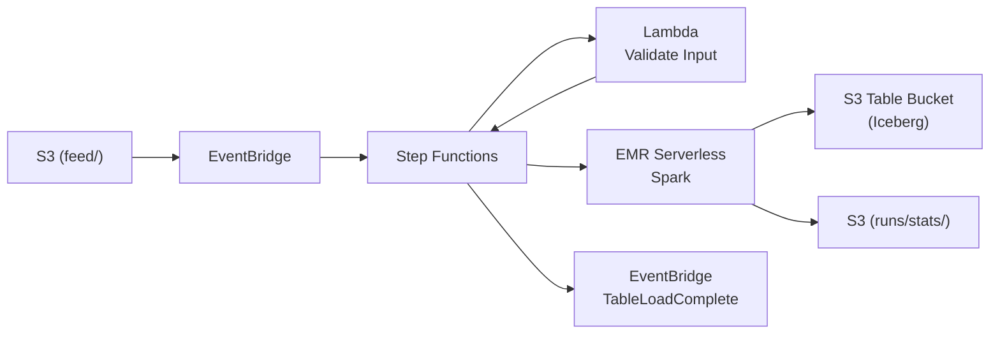

# aws-sam-serverless-etl

Serverless ETL pipeline that ingests Parquet files from S3 into [S3 Table Buckets](https://docs.aws.amazon.com/AmazonS3/latest/userguide/s3-tables.html) (managed Apache Iceberg) using AWS SAM, Step Functions, Lambda, and EMR Serverless.

## Architecture



### DataBucket File Directory

| Path | Purpose |
|------|---------|
| `feed/` | Incoming Parquet files |
| `runs/<execution>/stats/` | Per-table job stats JSON |
| `emr/` | PySpark script and dependency JARs |

### Compute Layer

| Service | Role |
|---------|------|
| Lambda | Validates input and resolves table names from file patterns |
| EMR Serverless (Spark) | Reads Parquet and writes to S3 Table Bucket via Iceberg |

### Orchestration Layer

| Service | Role |
|---------|------|
| Step Functions | Orchestrates validation → parallel EMR jobs → stats collection → EventBridge notification |
| EventBridge | Triggers the state machine when a file lands in `feed/` |

## Requirements

- Python 3.13
- [AWS SAM CLI](https://docs.aws.amazon.com/serverless-application-model/latest/developerguide/install-sam-cli.html)
- AWS CLI with a configured profile

## Build and Deploy

Set `AWS_PROFILE` to override the default profile (`dev`).

```bash
AWS_PROFILE=profile_name
```

Build and deploy

```bash
sam build
sam deploy
```

Then run the post-deploy script to upload the PySpark script and apply Lake Formation grants:

```bash
./scripts/post-deploy.sh
```

### Lake Formation Grants

If your account has Lake Formation enabled with restrictive settings (i.e. `IAMAllowedPrincipals` removed from default permissions), the post-deploy script applies the necessary grants automatically. The CloudFormation `PrincipalPermissions` resource doesn't support compound catalog IDs used by S3 Table Buckets, so these are applied via CLI. The grants are idempotent — safe to re-run.

## Run

```bash
./scripts/trigger.sh test-data.parquet
```

Or upload any Parquet file to the `feed/` prefix to trigger the pipeline:

```bash
./scripts/trigger.sh path/to/your-file.parquet
```

The state machine will start automatically via the EventBridge rule.
