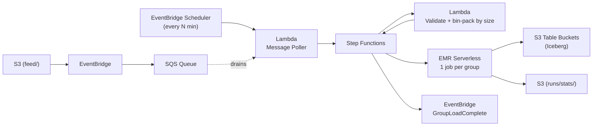

# aws-sam-serverless-etl

Serverless ETL pipeline that ingests Parquet files from S3 into S3 Table Buckets (managed Apache Iceberg) using 
AWS SAM, EventBridge Scheduler, Step Functions, Lambda, and EMR Serverless.

## Problem

Here's a hypothetical data engineering problem in the real world. 

An external team uploads parquet files (roughly 8-10) in S3 each day. They are 
provided usually at the same time, but can also be delayed by hours. The parquet 
files are intended to be added to their corresponding Iceberg tables. The parquet 
files are relatively small with hundreds of records. Every once and awhile, the 
external team will send parquet files that are larger than normal with hundreds of
millions of records.

You are on a small team, so your design should require the least amount of resource
management so when there are issues, you can diagnose the issue and ingest them as
quick as possible. Cost minimization is also a priority since the files are relatively
small.

## Proposed Solution

The solution in this repository helps to solve the problem points stated above.

- **S3 → EventBridge → SQS** 
  - When the parquet files are uploaded under the `feed/` prefix, the bucket sends an object created event 
    which is added to a SQS queue. The queue then stores all the parquet files ready 
    for ingestion until they are polled.

- **EventBridge Scheduler → Message Poller Lambda**
  - Since it's a daily job and the time may vary within a window, a scheduler invokes a 
    Lambda to check if there are any new messages. If there are messages,
    it will match them with their corresponding Iceberg tables based on the file name
    and kick off a state machine that will run the ingestion workflow. This is a 
    cost effective way to start ingestion workflows on batches of files only when necessary.

- **Step Functions → Validate Input Lambda → EMR Serverless**
  - In order to reduce the amount of resource management, we use a serverless workflow
    to ingest the files using Step Functions and orchestrate the ingestion jobs using
    EMR Serverless. This gives us access to a Spark runtime without having to manage
    a cluster.
  - A lambda validates the incoming files and groups them together based on a size 
    threshold. EMR Serverless is the most expensive tool here, so the idea is that
    if the files are normally small, we can group them into the same ingest job. 
    When we have a bigger file with millions of records, those files can be put in
    their own job to allocate separate resources.
  - In case a file fails, the workflow is intentionally indempotent, so an engineer
    can simply just retry running the state machine without the risk of duplicate 
    records.


## Architecture



## Requirements

- Python 3.13
- [AWS SAM CLI](https://docs.aws.amazon.com/serverless-application-model/latest/developerguide/install-sam-cli.html)
- AWS CLI with a configured profile

## Build and Deploy

First, open `samconfig.yaml` and fill in the `parameter_overrides` for your environment:

```yaml
parameter_overrides:
  - PrincipalOrgId=o-xxxxxxxxxx          # your AWS Organization ID
  - LoggingBucketName=my-logging-bucket  # existing S3 bucket for access logs
```

To use a non-default AWS profile, export `AWS_PROFILE` before running the commands.

```bash
export AWS_PROFILE=profile_name
sam build
sam deploy
./scripts/post-deploy.sh
```

### Lake Formation Grants

If your account has Lake Formation enabled with restrictive settings (i.e. `IAMAllowedPrincipals` removed from default permissions), the post-deploy script applies the necessary grants automatically. The CloudFormation `PrincipalPermissions` resource doesn't support compound catalog IDs used by S3 Table Buckets, so these are applied via CLI. The grants are idempotent — safe to re-run.

## Run workflow

Generate a batch of small test files (plus a couple large ones) across both
tables, then upload the whole folder at once:

```bash
python scripts/generate_test_data.py --out test-batch --count 10
./scripts/trigger.sh test-batch
```

Uploading to the `feed/` prefix adds all the files to the SQS queue. On its next run the
scheduled Message Poller drains the queue and starts **one** state machine
execution, which groups files together acccording to `BatchSizeThresholdBytes` value.

Expect:

- small files packed together into shared EMR jobs,
- each large file isolated into its own job,
- a single job writing to **both** tables (proving multi-table-per-job).

Watch the run in the Step Functions console, then preview the loaded rows using the
preview button on the S3 Table page. Because each row carries its `source_file`,
re-running a failed execution is safe — for each file the loader checks whether that
`source_file` is already in the table and appends only if it is not, so already-loaded
files are skipped.
